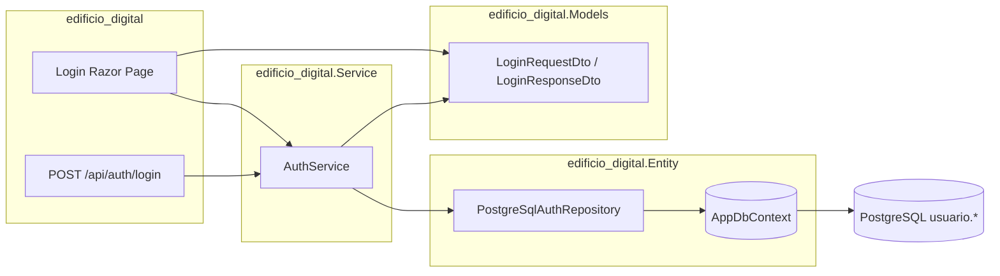

# Documentación técnica — solución **edificio_digital**

Este documento describe el estado actual de la práctica ubicada en `PRACTICAS/edificio_digital/` (solution `edificio_digital.slnx`), con énfasis en autenticación, base de datos y alineamiento con el DER.

---

## 1. Alcance del documento

- **Qué incluye**: proyectos ASP.NET Core de la carpeta actual, modelo de usuario/rol, flujo de login (Razor + API mínima), conexión a PostgreSQL mediante Entity Framework Core, y cómo todo esto se relaciona con `der-edificio-digital.dbml`.
- **Qué no incluye aún**: resto funcional del edificio digital (sedes, ambientes, reservas, etc.) más allá de lo que modelo el DER; esas áreas están preparadas conceptualmente en el DER pero **no están implementadas** como dominio aplicativo en código en esta revisión.

---

## 2. Referencia del modelo de datos (DER)

- **Ubicación del DER** (respecto a la carpeta de prácticas): `PRACTICAS/der-edificio-digital.dbml` — ruta de ejemplo en este equipo:  
  `c:\Users\e6243\Documents\PROYECTO WEB\PROYECTO DE UNAMAD\PRACTICAS\der-edificio-digital.dbml`

El DER define PostgreSQL como motor y agrupa dominios (sedes, edificios, ambientes, equipos, reservas, usuarios y roles entre otros).

### 2.1 Alineamiento con esta solución

| Aspecto | DER (dbml) | Implementación actual en código |
|--------|-------------|-----------------------------------|
| `usuarios`, `roles`, `usuarios_roles` | Tablas relacionadas como en el DER | Entity Framework mapea a esquema PostgreSQL **`usuario`**: tablas `usuario.usuarios`, `usuario.roles`, `usuario.usuarios_roles`. |
| Campo contraseña en `usuarios` | En el dbml aparece usuario sin campo `password` explícito | La aplicación usa columna física **`password`** en `usuario.usuarios` para validar login (credencial de prueba / texto plano en capa actual). Convendrá documentar esto como extensión respecto al dibujo lógico o actualizar el DER. |
| `usuarios_roles` | Incluye `vigencia_desde`, `vigencia_hasta` y índice único compuesto | El modelo C# declara `Id`, `UsuarioId`, `RolId` y navegación; **no** mapea aún vigencias. Ampliar cuando se use control de vigencia. |
| Rol mostrado en login | Roles vía `usuarios_roles` → `roles` | `AuthService` expone `Rol` desde el campo **`tipo`** del usuario (`UserCredentialEntity.TipoUsuario`), no desde la tabla `roles`. La relación muchos-a-muchos está modelada en EF para evolución futura. |

---

## 3. Arquitectura de la solución

La solución (`edificio_digital.slnx`) contiene cinco proyectos:

| Proyecto | Rol |
|----------|-----|
| **edificio_digital** | Host web: Razor Pages, pipeline HTTP, endpoint mínimo de API, registro de servicios y `DbContext`. |
| **edificio_digital.Entity** | EF Core: `AppDbContext`, entidades `Usuario`, `Rol`, `UsuarioRol`, repositorio de autenticación PostgreSQL e interfaces de acceso a credenciales. |
| **edificio_digital.Models** | DTOs de autenticación (`LoginRequestDto`, `LoginResponseDto`). |
| **edificio_digital.Service** | Lógica de aplicación: `AuthService` (validación de credenciales y armado de respuesta). |
| **edificio_digital.Client** | Biblioteca Razor (RCL) con referencia a `Microsoft.AspNetCore.Components.Web`; **placeholder** para componentes compartidos. El flujo de login implementado vive en el **host** (`Pages/Login`), no en el cliente Blazor aislado. |

### 3.1 Dependencias entre capas (auth)



### 3.2 Stack técnico

- **.NET**: `net10.0` (host y proyectos referenciados).
- **EF Core + PostgreSQL**: `Npgsql.EntityFrameworkCore.PostgreSQL` y `Microsoft.EntityFrameworkCore.Design` en el proyecto Entity.
- **Patrón**: inyección de dependencias — `AddDbContext<AppDbContext>`, `IAuthRepository` → `PostgreSqlAuthRepository`, `IAuthService` → `AuthService`.

---

## 4. Convenciones de código y base de datos

- **Esquema SQL**: todas las tablas de usuario gestionadas por este modelo usan el esquema **`usuario`**.
- **Nombres en español en C#**: por ejemplo `Contrasena`, `NombreCompleto`; las columnas físicas siguen nombres en inglés/snake donde aplica (`password`, `username`, `nombre_completo`).
- **`AppDbContext`**: configura Fluent API índices únicos sobre `Email` y `NombreUsuario`, y FKs entre `UsuarioRol`, `Usuario` y `Rol`.

---

## 5. Punto de entrada y configuración

- **`Program.cs`**: registra Razor Pages, Npgsql para `PostgreSql`, mapea `POST /api/auth/login`, usa `HttpsRedirection` y `Authorization` (sin autenticación por cookies configurada para sesión en esta etapa).

- **`appsettings.json`**: cadena típica:
  `Host=localhost;Port=5432;Database=...;Username=...;Password=...;Include Error Detail=true`

Variables sensibles conviene moverlas a usuario secreto (`appsettings.Development.json`), variables de entorno o un gestor de secretos fuera del repositorio.

---

## 6. Flujo de autenticación

### 6.1 Interfaz web (Razor)

- **Ruta**: `/Login` (`Pages/Login.cshtml` + `LoginModel`).
- **Formulario**: correo (`LoginRequestDto.Email`) y contraseña (`Contrasena`); validación con DataAnnotations.
- **UI**: tarjeta centrada, tonos **guinda/carmesí** (`#8a1538`, gradientes en botón).
- **Respuesta**: mensaje en alerta éxito/error; tras éxito muestra datos de `LoginResponseDto` incluido token de demostración.

### 6.2 API REST mínima

- **`POST /api/auth/login`**  
  Body JSON compatible con `LoginRequestDto`.  
  - **200**: cuerpo con `LoginResponseDto` cuando `IsSuccess` es verdadero.  
  - **401**: cuando falla usuario/contraseña o usuario inactivo.

### 6.3 Lógica en `AuthService`

- Normaliza entrada con `Trim` sobre correo y contraseña.
- Busca usuario activo por email (normalizado a minúsculas en consulta contra PostgreSQL via repositorio).
- Compara contraseña en **texto plano** (coincidencia literal con valor almacenado en BD).
- Mensaje de éxito (formato acordado con la práctica): incluye nombre completo e indica conexión correcta con la base de datos.
- `Token` actual: cadena **`token-demo-{guid}`**, sin JWT ni firma.

### 6.4 Repositorio `PostgreSqlAuthRepository`

- `GetByEmailAsync`: consulta sin tracking a `usuario.usuarios`, filtro `Email` ignorando mayúsculas y `Activo`, proyecta a `UserCredentialEntity` para desacoplar el servicio de la entidad completa persistida.

---

## 7. Entidades relevantes (`edificio_digital.Entity`)

- **`Usuario`**: `Id` (Guid), `NombreUsuario`, `Email`, `NombreCompleto`, `Tipo`, `Activo`, `Contrasena`, colección `UsuarioRoles`.
- **`Rol`**: `Id`, `Codigo`, `Nombre`, colección `UsuarioRoles`.
- **`UsuarioRol`**: clave compuesta lógica por `Id`, FKs a usuario y rol, navegación virtual en ambos sentidos.

Archivos bajo `model/usuario/` (convención de nombres con guion en `usuario-rol.cs` según aporte del ingeniero).

---

## 8. Requisitos para ejecutar

1. **SDK .NET** compatible con `net10.0` (la versión instalada en el equipo de desarrollo debe coincidir con la del proyecto).
2. **PostgreSQL** con base creada (p. ej. `edificio_db`) y **esquema `usuario`** con tablas alineadas al mapeo de `AppDbContext`.
3. Ajustar `ConnectionStrings:PostgreSql` en `appsettings.json` (o override local).
4. **Compilación**: si el host `edificio_digital` está en ejecución, el bloqueo de DLLs puede impedir `dotnet build`; detener el proceso antes de recompilar.

Comando típico desde la carpeta del host:

```bash
dotnet run --project edificio_digital/edificio_digital.csproj
```

---

## 9. Seguridad y deuda técnica conocida

| Tema | Estado |
|------|--------|
| Contraseñas | Comparación en claro; **no** apto para producción. Próximo paso habitual: hash (p. ej. ASP.NET Identity, PBKDF2/Argon2). |
| Sesión / cookies | No hay implementación de cookie de autenticación ni protección de rutas con `[Authorize]` en esta capa. |
| Rol en respuesta | Derivado de `tipo` de usuario, no de `roles` + `usuarios_roles`. |
| HTTPS | `UseHttpsRedirection` activo; en desarrollo puede requerir perfil con HTTPS o ajuste de `launchSettings.json` si aparecen avisos de redirección. |
| Migraciones EF | No documentadas como obligatorias en esta entrega; el modelo asume BD ya creada coherente con el mapeo. |
| DER vs BD real | Verificar que todas las tablas estén bajo `usuario` y no duplicadas en `public`; el DER no nombra esquemas por tabla — la convención del proyecto es explícita en código. |

---

## 10. Resumen de archivos clave

| Ruta (relativa a `edificio_digital/`) | Descripción |
|--------------------------------------|-------------|
| `edificio_digital/Program.cs` | DI, mapa de API, Razor. |
| `edificio_digital/appsettings.json` | Cadena PostgreSQL. |
| `edificio_digital/Pages/Login.cshtml` | Vista login. |
| `edificio_digital/Pages/Login.cshtml.cs` | `OnPostAsync` → `IAuthService`. |
| `edificio_digital.Entity/Data/AppDbContext.cs` | Mapeo tablas esquema `usuario`. |
| `edificio_digital.Entity/Auth/PostgreSqlAuthRepository.cs` | Consulta por email. |
| `edificio_digital.Service/Auth/AuthService.cs` | Reglas de login y mensaje. |
| `edificio_digital.Models/Auth/*.cs` | DTOs entrada/salida. |

---

## 11. Próximos pasos sugeridos (sin implementarlos aquí)

1. Añadir migraciones o script SQL versionado que cree `usuario.*` idéntico al modelo y al DER (incluyendo columnas que el DER liste y el código no mapee aún).
2. Sustituir token demo por JWT o cookie de aplicación según lineamiento del curso.
3. Resolver `Rol` desde `usuario.usuarios_roles` y `usuario.roles` con políticas de vigencia.
4. Unificar DER y BD (campo `password`, esquema `usuario` documentado en el diagrama si se mantiene).

---

*Última actualización conforme al análisis del código en el repositorio de prácticas.*
