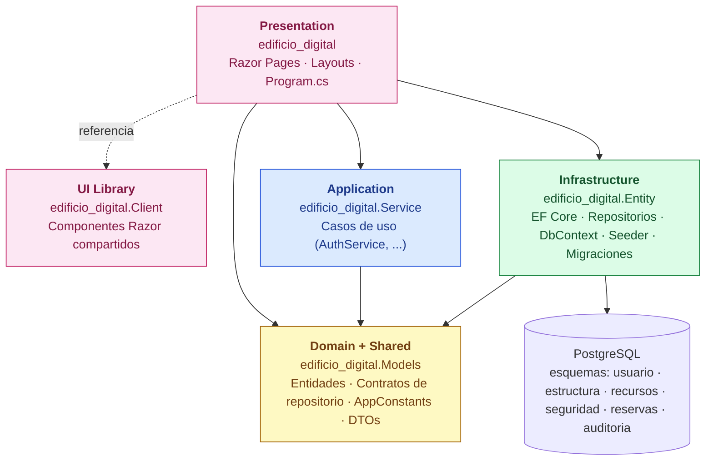
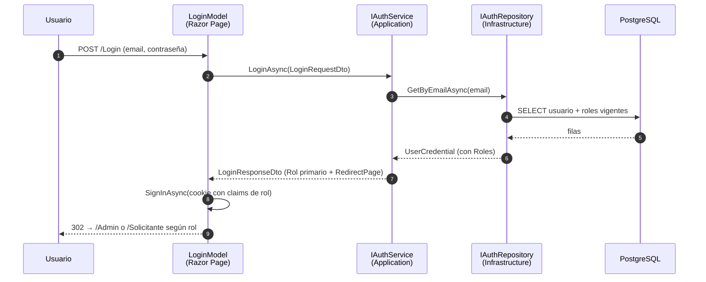

# edificio_digital

Aplicación monolítica en .NET 10 (Razor Pages + PostgreSQL) que gestiona ambientes, recursos y reservas. La solución sigue **Clean Architecture** con cinco proyectos cuyas dependencias apuntan siempre hacia el dominio.

## Arquitectura



**Reglas que respeta el código:**

- `Models` no referencia a nadie. Es el centro y vive sin dependencias técnicas (no conoce EF Core, ASP.NET, ni HTTP).
- `Service` depende solo de `Models`. Nunca conoce a EF Core ni a Postgres.
- `Entity` (Infrastructure) implementa los contratos definidos en `Models` y es el único que toca la base de datos.
- `edificio_digital` (Web) compone todo en `Program.cs`: registra DI, autenticación con cookies y políticas de autorización.

### Flujo de un caso de uso (login)



## Layouts y autorización

| Layout | Quién accede | Páginas de ejemplo |
|---|---|---|
| `_LayoutPublic` | Anónimos. Si un usuario logueado intenta entrar, se le redirige a su panel. | `/Index`, `/Privacy`, `/Login`, `/AccessDenied` |
| `_LayoutAdmin` | Solo rol `admin` (política `AdminOnly`) | `/Admin/Index`, `/Admin/Usuarios` |
| `_LayoutSolicitante` | Solo rol `solicitante` (política `SolicitanteOnly`) | `/Solicitante/Index`, `/Solicitante/NuevaReserva` |

El layout por defecto se define en `Pages/_ViewStart.cshtml`. Cada carpeta protegida tiene su propio `_ViewStart.cshtml` que sobreescribe el layout. Las políticas se aplican vía `AuthorizeFolder` en `Program.cs`.

## Constantes compartidas

`edificio_digital.Models/Common/AppConstants.cs` es la **única fuente de verdad** para nombres de rutas, layouts, roles, claims, políticas y esquema de cookie. Lo consumen tanto el host (al mapear endpoints y políticas) como las páginas Razor (al construir links). Cualquier consumidor futuro (Blazor WASM, móvil) usa las mismas constantes.

## Base de datos

- Motor: PostgreSQL (Npgsql + EF Core).
- Modelo alineado al DER `PRACTICAS/der-edificio-digital.dbml`.
- Esquemas: `usuario`, `estructura`, `recursos`, `seguridad`, `reservas`, `auditoria`.
- `bitacora_auditoria.valores_anteriores_json`, `valores_nuevos_json` y `historial_movimiento_global.detalle_json` usan `jsonb`.

## Ejecutar en local

1. Configura la cadena de conexión en `edificio_digital/appsettings.json` → `ConnectionStrings:PostgreSql`.
2. Arranca la app — el seeder crea la BD si no existe, aplica migraciones y deja listo el usuario inicial:

```powershell
dotnet run --project edificio_digital/edificio_digital.csproj
```

3. Abre `http://localhost:5049` e inicia sesión:

| Usuario | Contraseña | Rol |
|---|---|---|
| `admin@edificiodigital.com` | `admin` | `admin` |

El seeder es idempotente: si el usuario ya existe con otra contraseña, la actualiza al valor esperado.

## Aplicar migraciones manualmente

```powershell
dotnet ef database update `
  --project edificio_digital.Entity/edificio_digital.Entity.csproj `
  --startup-project edificio_digital/edificio_digital.csproj `
  --context AppDbContext
```

## Cómo seguir construyendo el sistema

Cada proyecto tiene su propio README con su responsabilidad y ejemplos de extensión:

- [edificio_digital.Models](edificio_digital.Models/README.md) — Dominio + DTOs + constantes
- [edificio_digital.Service](edificio_digital.Service/README.md) — Casos de uso (Application)
- [edificio_digital.Entity](edificio_digital.Entity/README.md) — EF Core, repositorios, migraciones, seeder
- [edificio_digital](edificio_digital/README.md) — Razor Pages, layouts, endpoints API, autorización
- [edificio_digital.Client](edificio_digital.Client/README.md) — Componentes Razor compartidos

### Receta rápida para una funcionalidad nueva

Para una funcionalidad de extremo a extremo (ej. "Reservas"), recorre las capas en este orden — siempre de adentro hacia afuera:

1. **Models** — define la entidad de dominio, el contrato del repositorio (`IReservaRepository`) y los DTOs.
2. **Service** — escribe `IReservaService` + `ReservaService` con la lógica del caso de uso.
3. **Entity** — implementa `PostgreSqlReservaRepository`, agrega `DbSet<Reserva>` al `AppDbContext` si falta, y crea la migración.
4. **Web** — registra los servicios en `Program.cs`, crea las páginas Razor y/o endpoints API usando `AppConstants.ApiRoutes`.

Cada README detalla el código de cada paso.

## Autenticación

- Cookie auth (esquema `EdificioDigitalAuth`).
- Login firma claims de rol con `ClaimTypes.Role`, lo que permite usar `[Authorize(Policy = ...)]` y `User.IsInRole(...)`.
- Logout: `POST /api/auth/logout` o `POST /Logout`.
- Por ahora la contraseña se compara en claro y el token retornado es de demostración. Endurecer con hashing (BCrypt/Argon2) y JWT productivo es trabajo pendiente cuando se requiera consumo desde clientes externos.
