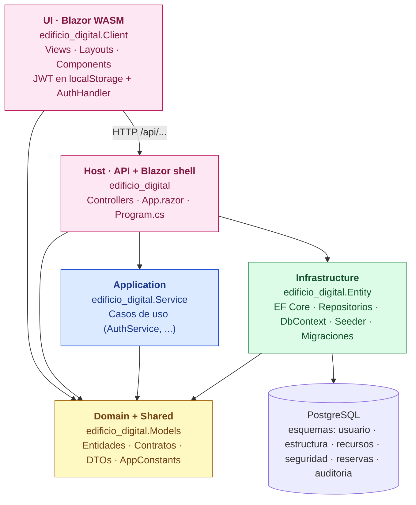
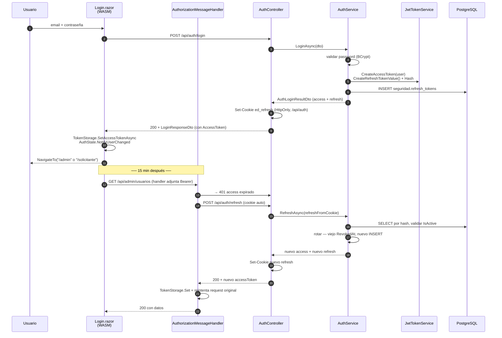

# edificio_digital

Aplicación en **.NET 10** que gestiona ambientes, recursos y reservas de un edificio. La UI corre como **Blazor WebAssembly** y consume una API HTTP del propio host. Auth por **JWT (access token corto en `localStorage`) + refresh token rotativo en cookie HttpOnly + revocación server-side en DB**. La solución sigue **Clean Architecture** con seis proyectos cuyas dependencias apuntan siempre hacia el dominio.

## Arquitectura



**Reglas que respeta el código:**

- `Models` no referencia a nadie. Es el centro y vive sin dependencias técnicas (no conoce EF Core, ASP.NET, ni HTTP).
- `Service` depende solo de `Models`. Nunca conoce a EF Core ni a Postgres.
- `Entity` (Infrastructure) implementa los contratos definidos en `Models` y es el único que toca la base de datos.
- `edificio_digital` (Web) es el composition root: registra DI, autenticación con cookies, expone los **controladores HTTP** y monta el **shell Blazor** (`App.razor`) que sirve la WASM.
- `edificio_digital.Client` es **Blazor WebAssembly puro**. Solo depende de `Models` (DTOs y constantes). Toda interacción con datos pasa por `HttpClient` contra `/api/...`.

### Flujo de un caso de uso (login + refresh)



## Layouts y autorización

| Layout | Quién accede | Páginas Blazor |
|---|---|---|
| `PublicLayout` | Anónimo o pre-login | `/`, `/login`, `/access-denied` |
| `AdminLayout` | Solo rol `admin` (política `AdminOnly`) | `/admin`, `/admin/usuarios` |
| `SolicitanteLayout` | Solo rol `solicitante` (política `SolicitanteOnly`) | `/solicitante`, `/solicitante/nueva-reserva` |

El layout se hereda por **carpeta** vía `Views/<Rol>/_Imports.razor`, que también declara el `[Authorize(Roles = ...)]` aplicable a toda la carpeta. La autorización del lado servidor vive en cada controlador con `[Authorize(Policy = ...)]`. El `<AuthorizeRouteView>` del cliente redirige a `/login` o `/access-denied` cuando una página no autoriza.

## Constantes compartidas

`edificio_digital.Models/Common/AppConstants.cs` es la **única fuente de verdad** para nombres de rutas API, roles, claims, políticas y esquema de cookie. Lo consumen tanto el host (al mapear endpoints y políticas) como las páginas Blazor (al construir links y leer roles desde claims). Cualquier consumidor futuro (móvil, integraciones) usa las mismas constantes.

## Diseño visual

El sistema de diseño está documentado en `.claude/skills/edificio-digital-design/SKILL.md` (paleta lila institucional OKLCH, tipografía Geist, patrones `ed-*` montados sobre Bootstrap 5). Lectura obligada antes de tocar UI. Tokens y utilidades viven en `edificio_digital/wwwroot/css/design-tokens.css`. Plantilla original de referencia: `plantill/edificio_digital/`.

## Base de datos

- Motor: PostgreSQL (Npgsql + EF Core).
- Modelo alineado al DER `PRACTICAS/der-edificio-digital.dbml`.
- Esquemas: `usuario`, `estructura`, `recursos`, `seguridad`, `reservas`, `auditoria`.
- `bitacora_auditoria.valores_anteriores_json`, `valores_nuevos_json` y `historial_movimiento_global.detalle_json` usan `jsonb`.

## Ejecutar en local

1. Configura la cadena de conexión en `edificio_digital/appsettings.json` → `ConnectionStrings:PostgreSql`.
2. Arranca la app — el seeder crea la BD si no existe, aplica migraciones y deja listo el usuario inicial. **Un solo `dotnet run` compila y sirve también el WASM** (no hace falta arrancar `.Client` aparte):

```powershell
dotnet run --project edificio_digital/edificio_digital.csproj
```

3. Abre `http://localhost:5049` e inicia sesión:

| Usuario | Contraseña | Rol |
|---|---|---|
| `admin@edificiodigital.com` | `admin` | `admin` |

El seeder es idempotente: si el usuario ya existe con otra contraseña, la actualiza al valor esperado.

Para hot reload mientras editas `.razor`:

```powershell
dotnet watch --project edificio_digital/edificio_digital.csproj
```

## Aplicar migraciones manualmente

```powershell
dotnet ef database update `
  --project edificio_digital.Entity/edificio_digital.Entity.csproj `
  --startup-project edificio_digital/edificio_digital.csproj `
  --context AppDbContext
```

## Cómo seguir construyendo el sistema

Cada proyecto tiene su propio README con su responsabilidad y ejemplos de extensión:

- [edificio_digital.Models](edificio_digital.Models/README.md) — Dominio + DTOs + constantes
- [edificio_digital.Service](edificio_digital.Service/README.md) — Casos de uso (Application)
- [edificio_digital.Entity](edificio_digital.Entity/README.md) — EF Core, repositorios, migraciones, seeder
- [edificio_digital](edificio_digital/README.md) — Host: controladores HTTP, Blazor shell, autorización
- [edificio_digital.Client](edificio_digital.Client/README.md) — UI Blazor WebAssembly (todas las páginas)

### Receta para una funcionalidad nueva extremo a extremo

Para una funcionalidad nueva (ej. "Reservas"), recorre las capas de adentro hacia afuera:

1. **Models** — entidad de dominio, contrato del repositorio (`IReservaRepository`) y DTOs (request/response).
2. **Service** — `IReservaService` + `ReservaService` con la lógica del caso de uso.
3. **Entity** — `PostgreSqlReservaRepository` + `DbSet<Reserva>` en `AppDbContext` (si falta) + migración.
4. **Server (`edificio_digital`)** — registra los servicios en `Program.cs`, crea el controlador en `Controllers/<Rol>/ReservasController.cs` con `[Authorize(Policy = ...)]`, expone los endpoints HTTP (`/api/<rol>/reservas/...`).
5. **Client (`edificio_digital.Client`)** — crea la página `.razor` en `Views/<Rol>/Reservas.razor` con `@page "/<rol>/reservas"`, inyecta `HttpClient` y consume el endpoint. Si el markup se repite, extrae a `Components/`.

Cada README detalla el código de cada paso.

## Autenticación

Esquema **JWT (HS256) + refresh token rotativo en DB**:

| Componente | Dónde vive | Propósito |
|---|---|---|
| **Access token** | `localStorage['ed_access_token']` (cliente) | Bearer en `Authorization` para llamadas a `/api/*`. TTL 15 min. |
| **Refresh token** (valor) | Cookie `ed_refresh` HttpOnly · SameSite=Strict · Path=`/api/auth` | Renovar el access sin re-login. TTL 7 días. |
| **Refresh token** (hash SHA-256) | `seguridad.refresh_tokens` en Postgres | Validar, rotar y revocar (logout real). |

Flujo:

- **Login**: `POST /api/auth/login` → 200 con `{ AccessToken, AccessTokenExpiresAt, ... }` y `Set-Cookie: ed_refresh`. Server inserta el hash del refresh en DB.
- **Llamadas API**: el `AuthorizationMessageHandler` (DelegatingHandler en WASM) adjunta `Authorization: Bearer <access>` automáticamente.
- **Refresh**: ante un 401, el handler llama a `POST /api/auth/refresh` (cookie auto-enviada por mismo origen). El server valida el hash en DB, marca el viejo `RevokedAt + ReplacedByTokenId`, inserta uno nuevo, devuelve nuevo access. El handler reintenta el request original. Todo transparente al componente.
- **Logout**: `POST /api/auth/logout` → server marca el refresh como `RevokedAt` (logout real, no "trust the client"), borra la cookie. Cliente limpia `localStorage`.
- **`/api/auth/me`**: devuelve los claims actuales del JWT (útil para diagnóstico; el cliente parsea el token localmente sin necesidad de este endpoint).

Validación del JWT en el server: `Microsoft.AspNetCore.Authentication.JwtBearer` con `ValidateIssuer`, `ValidateAudience`, `ValidateLifetime`, `ValidateIssuerSigningKey` activos y `ClockSkew = 30s`. Configurable en `appsettings.json` → `Jwt`.

Hashing de contraseña: `BCrypt.Net-Next` vía `IPasswordHasher`.

## Seguridad — XSS y headers

El access token vive en `localStorage`, lo que lo hace **leíble por cualquier JS que se ejecute en la app**. Si un atacante consigue inyectar script (XSS), roba la sesión. Estrategia de defensa en capas:

1. **Content-Security-Policy (CSP)** — configurada en `edificio_digital/Program.cs`. Bloquea por defecto carga de scripts/fuentes/conexiones de orígenes no autorizados:
   - `script-src 'self' 'wasm-unsafe-eval' https://cdn.jsdelivr.net` — solo Blazor + Bootstrap CDN.
   - `connect-src 'self'` — el WASM no puede llamar a APIs externas (exfiltración bloqueada).
   - `frame-ancestors 'none'` — clickjacking imposible.
   - `'unsafe-inline'` solo para `style-src` (necesario por Bootstrap + estilos inline en componentes); **nunca para `script-src`**.
2. **Headers complementarios** (también en `Program.cs`): `X-Content-Type-Options: nosniff`, `X-Frame-Options: DENY`, `Referrer-Policy: strict-origin-when-cross-origin`, `Permissions-Policy`, `Cross-Origin-Opener-Policy: same-origin`, `Cross-Origin-Resource-Policy: same-origin`.
3. **Render seguro por defecto**: Blazor escapa todo `@variable`. **Nunca** uses `MarkupString`, `@((MarkupString)html)` ni renderices HTML construido a partir de input del usuario. Si necesitas inyectar formato, usa componentes con `RenderFragment`, no strings con HTML.
4. **URLs dinámicas validadas**: si vas a usar `<a href="@url">` con `url` de origen no confiable, valida que comience con `/`, `https://` o un esquema permitido — bloquea `javascript:`. Misma regla para `src` de imágenes.
5. **Refresh token corto + rotación**: aunque se filtre el access, expira en 15 min. El refresh está en cookie HttpOnly (no leíble por JS) y rota en cada uso — un refresh robado pierde validez al primer refresh legítimo.
6. **Logout server-side**: marca el refresh en DB como revocado. Un atacante con cookie robada no puede renovar tras logout.
7. **CORS no necesario**: el WASM y la API viven en el mismo origen — no hay `Access-Control-Allow-Origin: *` que abuse.

Cuando agregues una nueva dependencia (CDN, API externa, font), recuerda extender CSP en `Program.cs`. Si Blazor falla a cargar tras un cambio, abre DevTools → Console y revisa errores `Refused to ...`.
